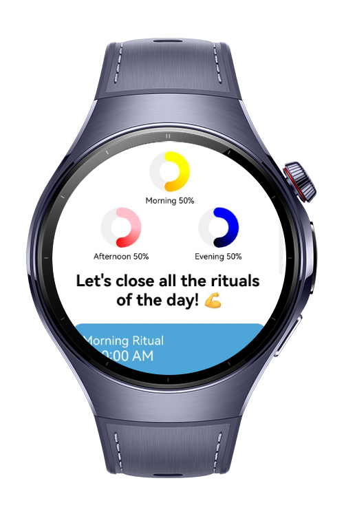
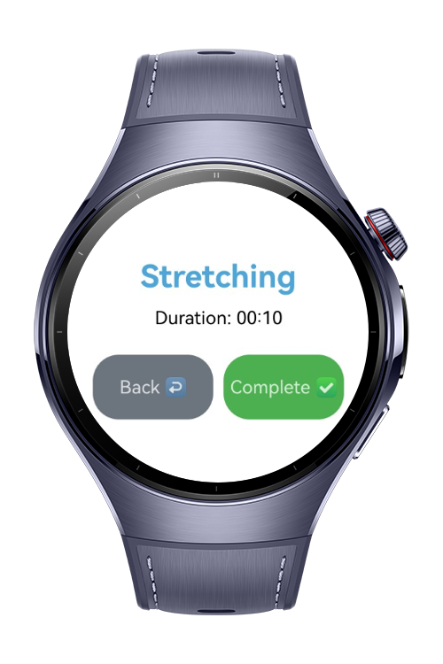
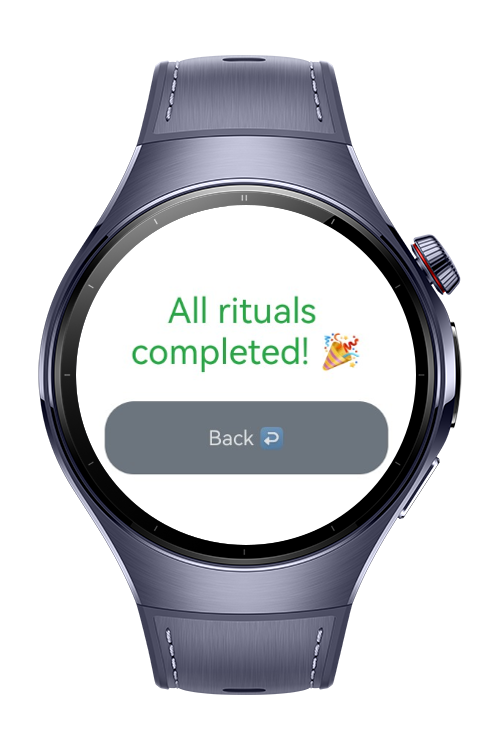

> **Note:** To access all shared projects, get information about environment setup, and view other guides, please visit [Explore-In-HMOS-Wearable Index](https://github.com/Explore-In-HMOS-Wearable/hmos-index).

# Habit Tracker

This HarmonyOS application helps users track daily rituals and personal growth habits. It provides habit tracking,
modular architecture, and reflective insights on daily activity. The goal is to demonstrate a structured and extensible
tracker app with basic navigation and state management.

# Preview

<div>
  
  
  
  
</div>

# Use Cases

- Track daily periods and rituals
- Reflect on current and past activities
- Navigate easily across habit management pages
- Extend modular architecture for new habit types

# Tech Stack

- **Languages**: ArkTS, ArkUI
- **Frameworks**: HarmonyOS SDK 5.0.2(14)
- **Tools**: DevEco Studio Version 5.1.0.828
- **Libraries**:
    - `@kit.AbilityKit`
    - `@kit.ArkUI`
    - `@kit.PerformanceAnalysisKit`

# Directory Structure

```
├── entry
│   └── src
│       ├── main
│       │   ├── ets
│       │   │   ├── core
│       │   │   │   ├── models
│       │   │   │   │   ├── PeriodModel.ets
│       │   │   │   │   └── RitualModel.ets
│       │   │   │   ├── services
│       │   │   │   │   ├── PeriodService.ets
│       │   │   │   └── stores
│       │   │   │       └── periodStore.ets
│       │   │   ├── entryability
│       │   │   │   └── EntryAbility.ets
│       │   │   ├── entrybackupability
│       │   │   │   └── EntryBackupAbility.ets
│       │   │   └── pages
│       │   │       ├── Index.ets
│       │   │       └── Period.ets

```

# Constraints and Restrictions

## Supported Devices

- Huawei Watch 5

# License

**Habit Tracker** is distributed under the terms of the MIT License. See the [LICENSE](LICENSE) for more information.
