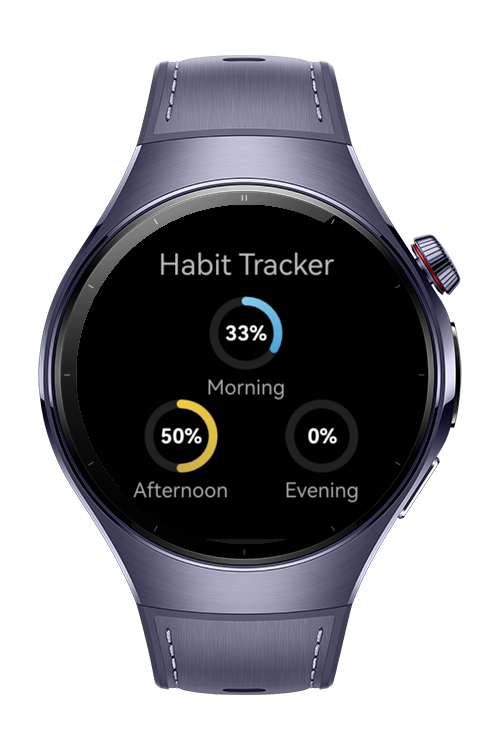
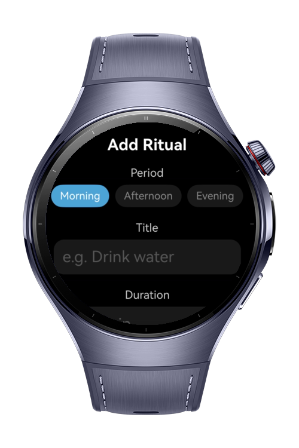

# Habit Tracker

A HarmonyOS wearable application for tracking daily rituals and personal growth habits. Features three time-based ritual periods (Morning, Afternoon, Evening) with support for normal tasks, breathing exercises with haptic coaching, and step tracking via the pedometer sensor. Users can add custom rituals, track completion progress through ring indicators, and maintain persistent state across app restarts with a local relational database.

# Preview

<div>
  
  
  
  
</div>

# Use Cases

- Track daily periods and rituals
- Add and manage custom habits per period
- Complete breathing exercises with guided haptic coaching
- Track steps automatically through the pedometer sensor
- Reflect on current and past activity through progress indicators
- Maintain habit data across app sessions

# Technology

## Stack
**Languages**: ArkTS, ArkUI

**Frameworks**: HarmonyOS SDK 5.1.0(18)

**Tools**: DevEco Studio Vers 5.1.0.842

**Libraries**: `@kit.AbilityKit`, `@kit.ArkUI`, `@kit.ArkData`, `@kit.SensorServiceKit`, `@kit.PerformanceAnalysisKit`

## Required Permissions
* `"ohos.permission.ACTIVITY_MOTION"`
* `"ohos.permission.VIBRATE"`

# Directory Structure

```
entry/src/main/ets/
├── core/
│   ├── models/
│   │   ├── PeriodModel.ets              # Period data class with progress/completion computed properties
│   │   └── RitualModel.ets              # Ritual data class with type enum (Normal, Breathing, Steps)
│   │
│   ├── services/
│   │   ├── DatabaseService.ets          # RDB wrapper for ritual CRUD operations and DB initialization
│   │   ├── PeriodService.ets            # Singleton managing periods, ritual state, and DB synchronization
│   │   └── SensorTrackingService.ets    # Pedometer sensor subscription and auto-completion of step rituals
│   │
│   └── stores/
│       └── PeriodStore.ets              # Legacy observable store with static period/ritual definitions
│
├── entryability/
│   └── EntryAbility.ets                 # App lifecycle, DB initialization, and permission requests
│
├── entrybackupability/
│   └── EntryBackupAbility.ets           # Backup ability for restore scenarios
│
└── pages/
    ├── Index.ets                        # Root entry with NavPathStack routing and screen-on management
    ├── HomePage.ets                     # Main dashboard with progress rings, period cards, and add button
    ├── Period.ets                       # Ritual execution screen with type-specific UI (breathing timer, step counter, normal done)
    └── AddRitualPage.ets               # Form page for creating custom rituals with period/type selection
```

# Constraints and Restrictions

## Supported Devices

- Huawei Watch 5

# License

**Habit Tracker** is distributed under the terms of the MIT License. See the [LICENSE](LICENSE) for more information.
